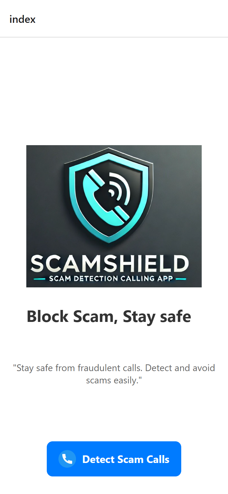
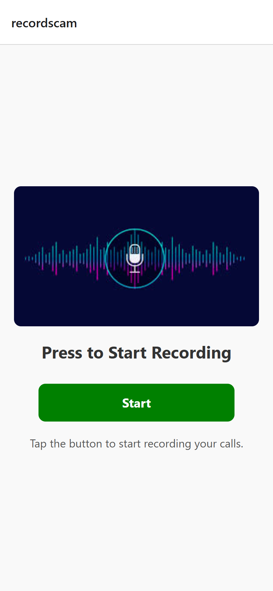
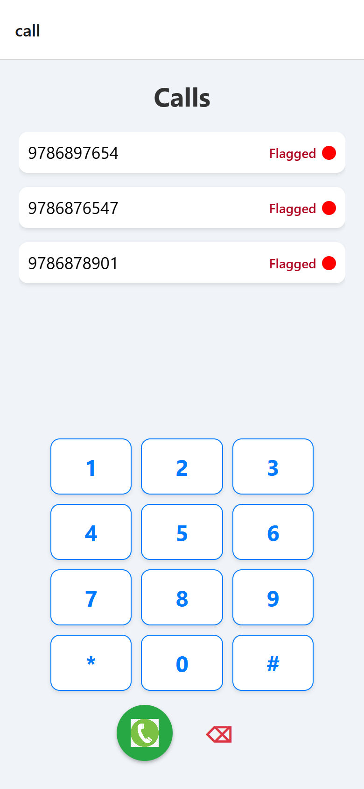
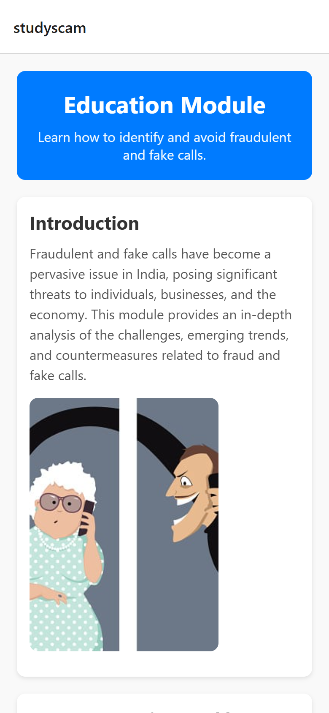
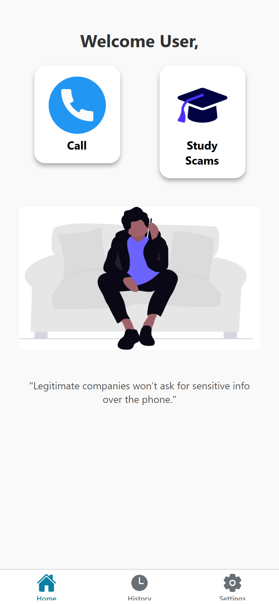
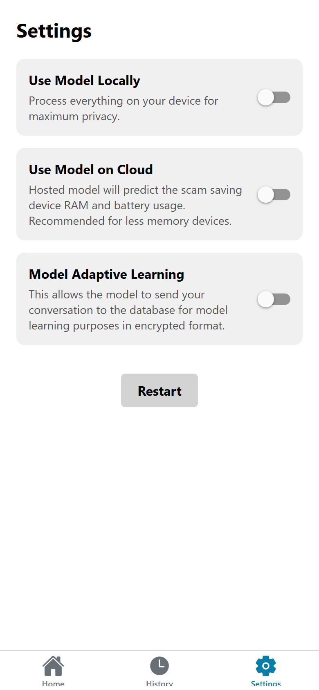

# ScamShield: real-time scam call detection

ScamShield listens to a live phone call, checks the transcript for known
scam tactics, and warns the user before they hand over money or an OTP. It
is a hackathon prototype built for the people scammers target most: elderly
family members and anyone new to smartphones.

## The Problem

Spam filters act on the caller's number, so they do nothing against a scam
that arrives from a fresh number. Scammers fill that gap with social
engineering: manufactured urgency, fake bank and government identities, and
demands for OTPs or remote access. Our pre-hackathon survey of 13
respondents (charts in [docs/survey-charts.jpg](docs/survey-charts.jpg),
comments in [docs/survey-responses.jpg](docs/survey-responses.jpg)) found
frequent scam attempts against the family members of elderly and
non-tech-savvy users. See [PRD.md](PRD.md) for the full problem statement.

## What ScamShield Does

* Scam detection: a fine-tuned DistilBERT model scores the live
  conversation transcript for scam indicators (OTP requests, urgency and
  pressure tactics, remote-access demands, suspicious offers).
* Colour-coded verdicts: Green (Safe) / Yellow (Suspicious) / Red (Scam),
  each with a suggested action such as hanging up.
* Privacy: audio chunks are processed per call and transcription data is
  only stored with user consent; caller numbers are never stored in
  plaintext (keyed-hash at rest) and saved call records are purged after a
  30-day retention window.
* Feedback loop: user corrections ("correct" / "incorrect") are stored and
  folded back into retraining (`src/train.py --retrain` path).
* Education module: the warning signs of scam calls, in the Gradio UI and
  the mobile app.

## Architecture

```
Phone call audio (Expo/React Native app or Gradio demo)
        │  base64 audio chunk
        ▼
FastAPI backend (src/backend.py)  ──►  SQLite (src/db.py, scam_calls.db)
        │                              - call records + user feedback
        ▼                              - model training metadata
pydub (ffmpeg) → WAV
        ▼
SpeechRecognition (Google STT) → transcript
        ▼
DistilBERT scam classifier (src/predict.py, trained by src/train.py)
        ▼
{scam_probability, status, transcription}
```

**Tech stack:** Python 3.12+, FastAPI, Transformers (DistilBERT),
SpeechRecognition, pydub, Gradio, SQLite · uv for dependency management ·
React Native 0.86 / Expo SDK 57 frontend (`frontend/`).

## Screenshots

Captured from a real run of this repository: the backend was started with
`uv run uvicorn backend:app --app-dir src` and exercised with real audio
over HTTP, and the frontend below is the SDK 57 web export
(`npx expo export --platform web`) served and driven in a browser.

| Home | Record a call | Calls |
|---|---|---|
|  |  |  |
| **Education** | **Tab: landing** | **Tab: settings** |
|  |  |  |

In the web export the status bar shows the route name; on a device the
navigation chrome comes from Expo Router's native tabs.

## Getting Started

### Prerequisites

* [uv](https://docs.astral.sh/uv/) (Python + dependency manager)
* **ffmpeg** on your system PATH (pydub needs it to decode MP3/3GP/M4A/OGG
  audio; WAV works without it)
* A Google Speech Recognition–reachable internet connection (transcription
  is cloud-based)

### Install

```bash
uv sync              # creates .venv and installs the locked dependencies
uv run pytest        # optional: run the test suite (offline, no model needed)
```

### Train the model (required before first run)

No trained weights are committed to the repository. The first backend start
would otherwise fall back to the *untrained* base model (it logs a loud
warning). Produce real weights with:

```bash
uv run python src/train.py            # trains on src/dataset.csv (1,245 labelled records)
```

Training records accuracy and metadata in SQLite (`model_metadata` table)
and saves the model to `model/scam_detector/`. To fold in user feedback
later: `uv run python -c "from train import train_model; train_model(retrain=True)"`.

### Run the backend API

```bash
# Required before saving calls that include a caller number (PII is stored
# only as a keyed hash — a missing key makes /save-call return 503):
export SCAMSHIELD_CALLER_KEY="a-long-random-secret"   # Windows: setx SCAMSHIELD_CALLER_KEY "a-long-random-secret"
uv run python src/backend.py          # http://0.0.0.0:8000
```

Saved call records are purged automatically when they are older than
`CALL_RECORD_RETENTION_DAYS` (30 days, `src/config.py`); the purge runs at
every backend startup.

Key endpoints:

| Endpoint | Method | Purpose |
|---|---|---|
| `/health/` | GET | Liveness check |
| `/detect-scam/` | POST | `{call_id, base64}` audio chunk → `{scam_probability, status, transcription}` |
| `/save-call/` | POST | Persist a finished call (+ optional user feedback) |
| `/abandoned-calls/` | GET | Drop stale call sessions |
| `/model-info/` | GET | Latest training metadata |
| `/education/` | GET | Scam-education HTML module |

### Run the Gradio demo (no mobile app needed)

```bash
uv run python src/gradio_interface.py
```

Upload an audio file, get the transcript, scam probability and colour-coded
verdict. (`share=True` opens a public tunnel; edit the source if you don't
want that.)

### Run the Expo frontend (SDK 57)

```bash
cd frontend
npm install
npx expo start            # press a for Android, i for iOS, w for web
```

The backend address the app records against lives in
`frontend/constants/Api.ts` (default `http://localhost:8000`); change it
there when the backend runs on another machine on your LAN.

Frontend quality gates (all verified green on this revision):

```bash
cd frontend
npx tsc --noEmit          # type check
npx jest                  # tests (offline)
npx knip --no-progress    # dead code / dependency audit
npx expo-doctor           # SDK health check
```

## Development

```bash
uv run ruff check src tests        # lint
uv run ruff format src tests       # format
uv run mypy src                    # type-check
uv run pytest --cov=src            # tests + coverage
uv run deptry .                    # dependency hygiene (config in pyproject)
uvx vulture src --min-confidence 80   # dead code
```

CI (`.github/workflows/ci.yml`) runs the Python gates on 3.12/3.13, the
coverage floor (≥90 % on core modules), and a frontend job (tsc, jest,
knip). GitHub Actions is disabled on this repository (owner decision, see
the CI note at the end of this file), so the gates run locally — every
command was executed and green at the current HEAD
([docs/STATUS.md](docs/STATUS.md) has the numbers).

See [docs/AUDIT.md](docs/AUDIT.md) for the codebase audit,
[docs/design.md](docs/design.md) for the HLD/LLD,
[docs/BUILD_LOG.md](docs/BUILD_LOG.md) for the engineering history,
[docs/STATUS.md](docs/STATUS.md) for the current measured state,
[EVALUATION.md](EVALUATION.md) for model evaluation and limitations,
[docs/adr/](docs/adr/) for decision records, [PRD.md](PRD.md) for the
product requirements, and [docs/style-guides/](docs/style-guides/) for the
coding conventions.

## Roadmap

* Train and ship the fine-tuned weights (the repo refuses to fake this:
  `/model-info/` stays empty until a real run).
* On-device inference so audio never leaves the phone.
* A user toggle for contributing feedback data to retraining.
* Multilingual training data (the STT language is already configurable).
* Emergency contacts and in-app reporting.

## Team TechnoTitans

ScamShield is our hackathon project. See [EVALUATION.md](EVALUATION.md)
for the honest state of the model and the known limitations.

## License

See [LICENSE](LICENSE).

## CI note (2026-09-16)

GitHub Actions is DISABLED on this repository by owner decision (no paid
Actions: the account is billing-blocked and the owner declined spend).
Every quality gate was verified by local execution at the recorded HEAD.
Zero-cost remote option if ever wanted: a self-hosted runner (re-enable
via Settings -> Actions, or gh api -X PUT
repos/pranam-s/scamshield/actions/permissions -F enabled=true).
