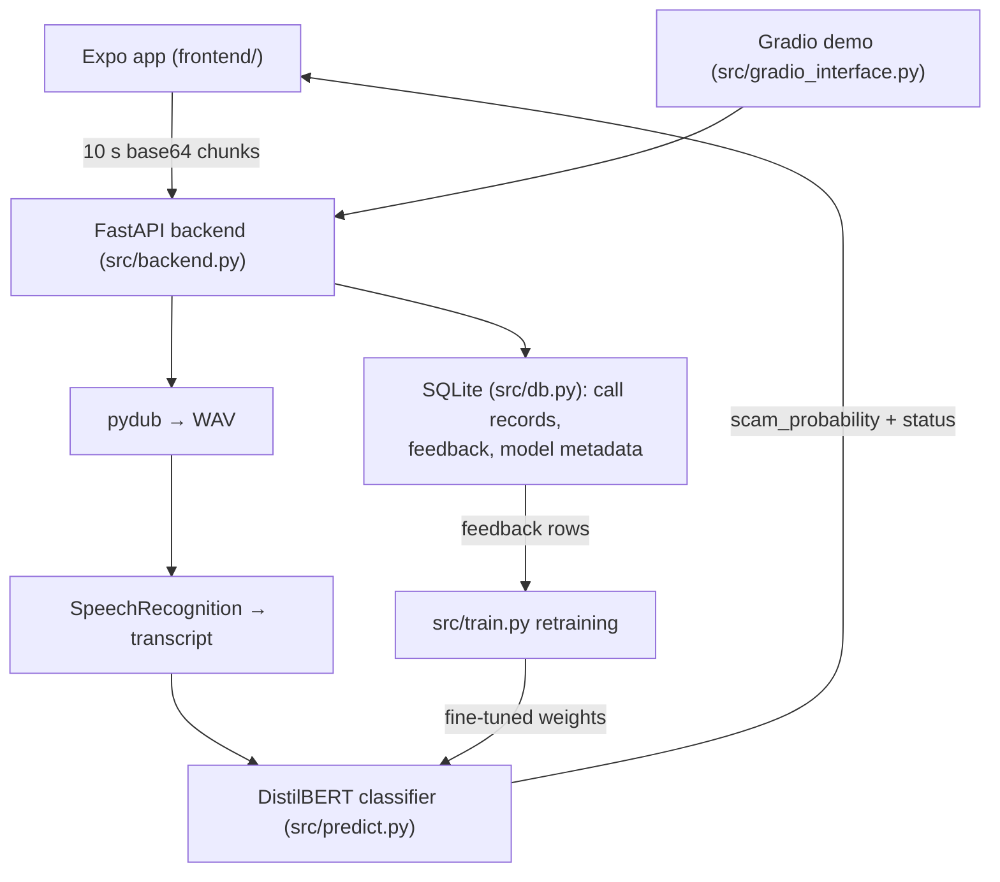

# Design: ScamShield

High-level and low-level design. The product story lives in the README and
PRD; the engineering history in BUILD_LOG.md; measured numbers in
EVALUATION.md and STATUS.md.

## 1. System shape (HLD)

ScamShield detects scam phone calls in near real time. Three deployable
pieces share one backend:

- **FastAPI backend** (`src/backend.py`): receives base64 audio chunks,
  transcribes them, scores them for scam indicators, and stores consented
  call records in SQLite.
- **Expo/React Native app** (`frontend/`): the user-facing surface:
  records call chunks, shows colour-coded verdicts, call history, and an
  education module.
- **Gradio demo UI** (`src/gradio_interface.py`): a browser demo of the
  same detection pipeline for quick manual testing.

### Design principles

1. **Fail loud, degrade honest.** No trained weights? The backend logs a
   warning and serves the base model, and `/model-info/` reports
   "No model metadata found" rather than inventing an accuracy number.
2. **Privacy at the boundary.** Caller numbers are HMAC-hashed before
   storage; legacy plaintext values are scrubbed to NULL on init; saved
   records are purged after the retention window; transcription is only
   stored with user feedback consent.
3. **Tests run offline.** The suite never downloads weights or calls
   external services; ML boundaries are stubbed in `tests/conftest.py`.
4. **No import-time side effects.** Models and the database load in the
   FastAPI lifespan, so importing `backend` is cheap and test-friendly.

## 2. Data flow: one audio chunk

1. The app records a 10-second chunk (expo-audio, high-quality preset),
   base64-encodes it, and POSTs `{call_id, base64}` to `/detect-scam/`.
2. The backend decodes the payload (400 on invalid base64), converts to
   WAV with pydub, and transcribes with SpeechRecognition
   (Google Web Speech). 422 when speech cannot be understood.
3. `predict_scam` tokenizes the transcript and scores it with DistilBERT;
   `get_status_details` maps the probability to Safe / Suspicious / Scam
   with a suggested action.
4. The response carries `{scam_probability, status, transcription}`; the
   app raises a blocking alert on a Scam verdict.

The web endpoint URL lives in `frontend/constants/Api.ts` (the original
hardcoded ngrok tunnel was AUDIT #19 and died with the hackathon).

## 3. Module breakdown (LLD)

| Module | Responsibility | Must not contain |
|---|---|---|
| `src/backend.py` | Routes: `/detect-scam/`, `/save-call/`, `/abandoned-calls/`, `/education/`, `/health/`, `/model-info/`; lifespan model+DB load; in-memory `active_calls` registry | Import-time model loads |
| `src/predict.py` | Audio→WAV, STT, scoring; lazy tokenizer singleton; status/colour mapping shared by backend and UIs | Route handling |
| `src/train.py` | Fine-tuning + `--retrain` feedback loop; writes accuracy/metadata to SQLite | Any API concern |
| `src/dataset_setup.py` | CSV → HF Dataset → tokenization | Training logic |
| `src/config.py` | All shared constants and paths, anchored to `PROJECT_ROOT` | Scattered literals elsewhere |
| `src/db.py` | SQLite schema, caller-number HMAC, retention purge, feedback loading | Business thresholds |
| `src/gradio_interface.py` | Browser demo; lazy model load on first detection | Storage logic |
| `frontend/app/` | Expo Router screens (tabs: landing/history/setting; call dialer; recording; education) | Business logic beyond display |
| `frontend/constants/Api.ts` | Backend URL + chunk interval (single source) | Hardcoded endpoints in screens |

## 4. Data model

SQLite (`call_records`, `model_metadata`):

- **call_records**: `call_id` PK, `start_time`/`end_time` (stored as
  `YYYY-MM-DD HH:MM:SS` strings via `db.to_sqlite_timestamp`, so text
  ordering equals time ordering and sqlite3's deprecated default adapters
  are never used), `duration`, `caller_number` (HMAC-SHA256 with
  `hmac-sha256:` prefix, or NULL), `full_transcription`, `user_feedback`,
  `final_status`, `model_version_used`.
- **model_metadata**: one row per training run: model name, training
  date (server default), dataset version, accuracy, epochs, label count.
  Served verbatim by `/model-info/`.

Retention: `purge_expired_calls` deletes rows whose `end_time` is older
than `config.CALL_RECORD_RETENTION_DAYS` (30); rows without `end_time`
are conservatively kept.

## 5. Auth and threat posture

There is no user accounts system (prototype scope). The security-relevant
surfaces are: base64 payload validation (400 on bad input, size-checked),
caller-number hashing (key from `SCAMSHIELD_CALLER_KEY` env; missing key
is a 503, never a silent fallback), no exception text in responses
(generic 4xx/5xx messages, details to the server log), and the retention
purge. The frontend targets the backend over plain HTTP on the LAN;
TLS termination is a deployment concern, documented not solved.

## 6. Frontend architecture (SDK 57)

- Expo SDK 57, React Native 0.86, React 19.2, Expo Router with a
  `(tabs)` layout; New Architecture is the only mode.
- Recording uses expo-audio's `useAudioRecorder` hook: prepare → record →
  stop → read the file through expo-file-system's `File.arrayBuffer()` →
  base64 (Hermes `btoa` over 32 KB slices) → POST. One recorder instance
  is reused across chunks.
- Tab-bar helpers import from expo-router's vendored React Navigation
  (`expo-router/build/react-navigation/*`) because SDK 57 no longer lists
  the standalone packages as peers; the standalone `@react-navigation/*`
  dependencies are gone.
- Accessibility: interactive elements carry `accessibilityRole`,
  `accessibilityLabel`, and (where meaningful) `accessibilityState`; call
  status is conveyed by text and colour; decorative emoji are not used as
  bullet markers.

## 7. Key decisions (index)

| Decision | Record |
|---|---|
| Expo SDK 52→57 single-jump upgrade; expo-av→expo-audio; dead deps removed; ngrok URL moved to constants | docs/adr/0001 |
| Caller numbers stored only as keyed hashes; missing key = hard 503 | docs/AUDIT.md #21 |
| 30-day retention purge; no-end_time rows kept | docs/AUDIT.md #21 |
| sqlite3 datetime adapter deprecations fixed at the boundary (string timestamps) | docs/STATUS.md |
| train.py / gradio_interface.py excluded from the 90% coverage gate (need real model download/training) | AGENTS.md, ci.yml |

## 8. Failure modes

- **No model / no weights:** base-model fallback with a logged warning;
  `/model-info/` stays empty until a real training run.
- **Non-speech audio:** STT returns "could not understand audio" → 422.
- **STT service unreachable:** 502-class error, generic message.
- **Missing caller key:** `/save-call/` refuses with 503 instead of
  storing plaintext.
- **Dead detection URL (frontend):** eliminated as a class; endpoints
  come from `constants/Api.ts`, never inline strings.
